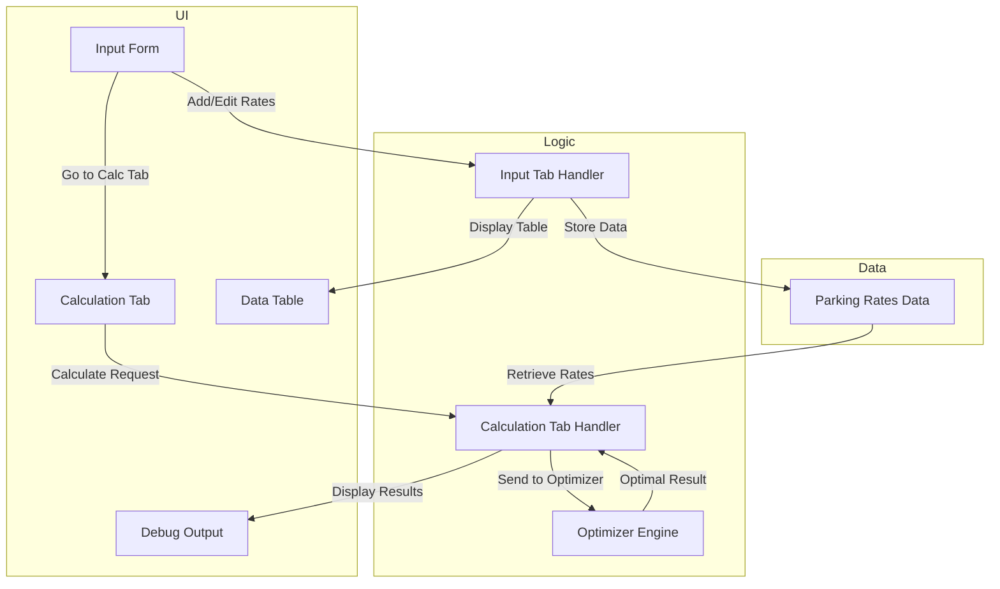

# Parking Rate Manager

A Shiny application for helping users determine the most cost-effective parking option based on their usage patterns.

## Features

- **Rate Management**: Add, edit, and delete parking rates for various locations
- **Multiple Rate Types**: Support for hourly, daily, and monthly rates
- **Rate Optimisation**: Calculates the most cost-effective parking option based on usage
- **Import/Export**: Import rates from CSV files
- **Interactive UI**: User-friendly interface with tabbed navigation

## Application Structure



## How It Works

1. **Input Tab**: Users can add parking rates with the following information:
   - Location name
   - Rate type (hourly, daily, or monthly)
   - Duration range (for hourly rates)
   - Cost

2. **Calculation Tab**: Users input their parking usage patterns:
   - Hours per day
   - Days per month
   - The application then calculates the most cost-effective parking option

3. **Optimization Logic**:
   - For hourly rates: `Cost = Rate × Hours per day × Days per month`
   - For daily rates: `Cost = Rate × Days per month`
   - For monthly rates: `Cost = Rate`
   - The application uses linear programming to find the lowest-cost option

## File Structure

- `app.R`: Main application file with Shiny app initialization
- `ui_tab_input.R`: UI components for the input tab
- `ui_tab_calculation.R`: UI components for the calculation tab
- `server_tab_input.R`: Server logic for the input tab
- `server_tab_calculation.R`: Server logic for the calculation tab
- `*.csv`: Sample rate files for different locations

## Requirements

- R (>= 4.0.0)
- Packages:
  - shiny
  - DT (DataTables)
  - bslib
  - lpSolve

## Installation and Usage

1. Clone the repository
   ```bash
   git clone https://github.com/yourusername/parking-rate-app.git
   cd parking-rate-app
   ```

2. Install required packages if not already installed
   ```r
   install.packages(c("shiny", "DT", "bslib", "lpSolve"))
   ```

3. Run the application
   ```r
   shiny::runApp()
   ```

## Sample Data

The application comes with sample CSV files:
- `rosebank_rates.csv`: Sample rates for Rosebank location
- `example_rates_with_daily.csv`: Example rates including daily options

## Contributing

Contributions are welcome! Please feel free to submit a Pull Request.

## License

This project is licensed under the MIT License - see the LICENSE file for details.