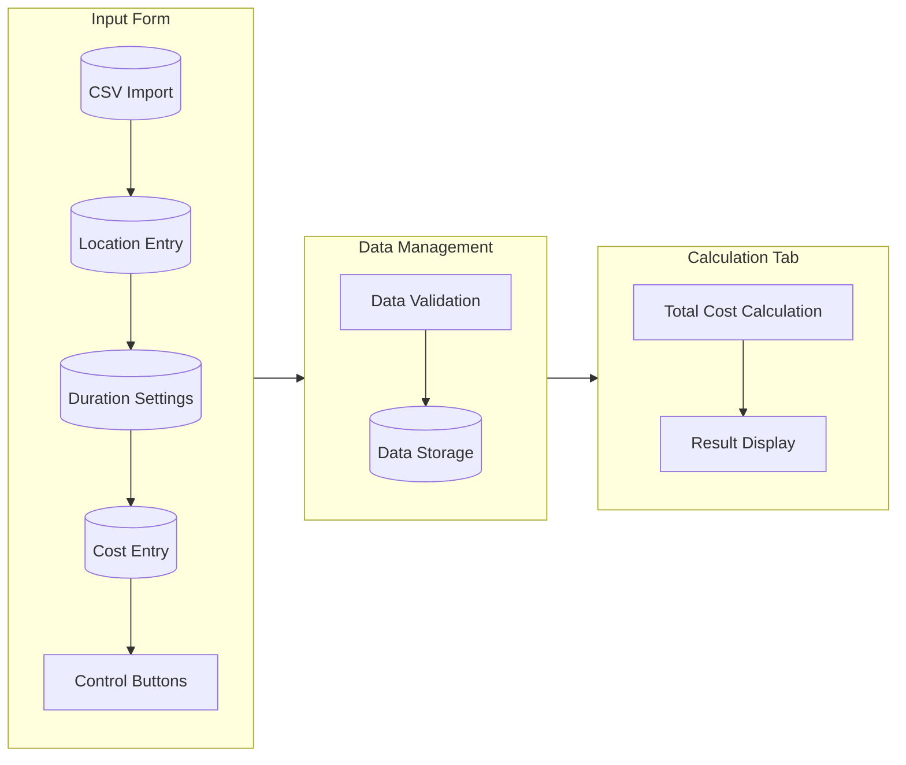

# Parking Rate Manager

A Shiny application for managing and calculating parking rates across different locations.

## Features

- **Rate Management**: Add and manage parking rates for different locations
- **Flexible Duration Types**: Support for hourly, daily, and monthly rates
- **Data Validation**: Prevents overlapping time ranges and duplicate monthly rates
- **CSV Import**: Bulk import rates from CSV files
- **Cost Calculation**: Calculate total parking costs across all entries

## System Requirements

- R
- Required R packages:
  - shiny
  - DT (DataTables)
  - bslib (Bootstrap themes)

## Installation

1. Clone this repository
2. Install the required R packages:
   ```R
   install.packages(c("shiny", "DT", "bslib"))
   ```
3. Run the application:
   ```R
   shiny::runApp()
   ```

## Architecture



## Usage

1. **Input Form Tab**:
   - Enter location name
   - Select duration type (Hourly/Daily/Monthly)
   - For hourly rates:
     - Set duration range (from/to hours)
   - Enter cost amount
   - Click "Add Entry" to save
   - Use "Delete Selected Entry" to remove rates

2. **CSV Import**:
   - Prepare CSV with the following columns:
     - `Location`: Name of the parking location (text)
     - `DurationType`: Either "Hourly", "Daily", or "Monthly"
     - `DurationFrom`: Start hour for hourly rates (number, leave empty for monthly)
     - `DurationTo`: End hour for hourly rates (number, leave empty for monthly)
     - `Cost`: Rate amount in currency (number)
   - Use the CSV import button to bulk load rates   Example CSV content:
   ```csv
   Location,DurationType,DurationFrom,DurationTo,Cost
   City Central,Hourly,0,2,15
   City Central,Hourly,2,4,25
   City Central,Daily,,,100
   City Central,Monthly,,,500
   Mall Parking,Hourly,0,3,20
   Mall Parking,Daily,,,90
   Mall Parking,Monthly,,,600
   ```   Notes:
   - For daily and monthly rates, leave DurationFrom and DurationTo empty
   - Hourly rates must not overlap for the same location
   - Only one daily rate is allowed per location
   - Only one monthly rate is allowed per location
   - Cost values should be numbers without currency symbols

3. **Calculation Tab**:
   - Set the hours per day and days per month parameters
   - Click "Calculate Optimal Rate" to find the most cost-effective option
   - The calculation will:
     - Apply hourly rates that match your daily hours
     - Calculate monthly costs for daily rates (daily rate × days per month)
     - Compare all applicable options (hourly, daily, and monthly)
     - Select the lowest cost option
   - View detailed results showing the optimal choice and calculations

## Data Validation

The application includes several validation checks:
- Empty location names are not allowed
- Hourly duration ranges cannot overlap for the same location
- Only one daily rate is allowed per location
- Only one monthly rate is allowed per location
- CSV imports are validated for format and data consistency

## Styling

The application uses the "minty" Bootswatch theme for a clean, modern appearance.

